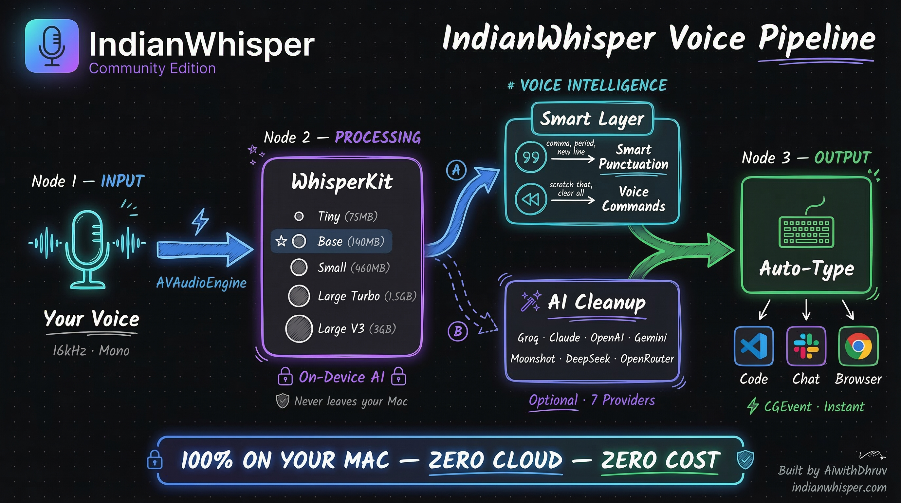

# IndianWhisper

**100% on-device voice transcription for Mac. Free. No cloud. No subscription.**

[Download](https://indianwhisper.com) | [Try Live Demo](https://indianwhisper.com/#try-it) | [ROI Calculator](https://indianwhisper.com/#calculator)

---

## Architecture



---

## What is IndianWhisper?

IndianWhisper is a free, on-device voice-to-text app for Mac. It uses OpenAI's Whisper AI models (via WhisperKit) to transcribe your speech and auto-type it wherever your cursor is — VS Code, Slack, Chrome, Terminal, anywhere.

Your voice data **never leaves your computer**. No cloud. No API calls. No tracking.

### Why?

| App | Price | Privacy |
|-----|-------|---------|
| **IndianWhisper** | **Free** | **100% on-device** |
| Wispr Flow | $8/month | Cloud-based |
| BridgeVoice | $50/month | On-device |
| macOS Dictation | Free | Cloud (Apple) |

---

## Features

- **5 Whisper models** — Tiny (75MB) to Large V3 (3GB). Pick your speed vs accuracy.
- **Auto-type anywhere** — Types directly at your cursor in any app via CGEvent.
- **Smart punctuation** — Say "comma", "period", "question mark", "new line".
- **Voice commands** — "Scratch that" to undo, "delete word", "clear all".
- **Hindi / Hinglish** — Speak in Hindi, get clean English text.
- **AI text cleanup** — Optional LLM polish with 7 providers (Groq, Claude, OpenAI, Gemini, Moonshot, DeepSeek, OpenRouter).
- **42x real-time** on Apple Silicon. 800MB RAM.

---

## Website

The website at [indianwhisper.com](https://indianwhisper.com) includes:

- **Live voice demo** — Try voice-to-text in your browser (no install)
- **ROI Calculator** — See how many hours you waste typing per year
- **AI voice assistant** — Ask anything about the app (Gemini TTS)
- **Feedback form** — Type or speak your feedback
- **Model comparison table** — All 5 models with specs
- **Competitor comparison** — IndianWhisper vs Wispr vs BridgeVoice

### Tech Stack

| Layer | Technology |
|-------|-----------|
| Frontend | Next.js 16, Tailwind CSS v4, TypeScript |
| AI Voice | Gemini 2.5 Flash TTS (native audio) |
| Live Demo | Web Speech API (browser built-in) |
| Hosting | Vercel |
| Feedback | formsubmit.co |

---

## Mac App

### Quick Start

```bash
# Download from website
open https://indianwhisper.com

# Or build from source
cd WhisperAiwithDhruv
swift build -c release
./deploy.sh        # Install to /Applications
./deploy.sh dmg    # Create DMG installer
```

### Requirements

- macOS 14 Sonoma or later
- Apple Silicon (M1/M2/M3/M4) & Intel
- 4 GB RAM minimum (8 GB for Large models)

### App Tech Stack

| Layer | Technology |
|-------|-----------|
| Language | Swift 5.9 |
| Transcription | WhisperKit 0.9.0+ |
| Audio | AVAudioEngine (16kHz mono) |
| Typing | CGEvent + clipboard fallback |
| Hotkey | Carbon API (Cmd+D) |
| Cloud TX | Gemini 2.5 Flash (optional) |
| LLM Cleanup | 7 providers with 3-layer prompt injection defense |

---

## Community Edition

This is the **Community Edition** — all features are unlocked for free:

- All 5 Whisper models available
- Unlimited transcription (no daily limits)
- Unlimited LLM cleanups
- No license key required

---

## Contributing

Found a bug? Have a feature idea?

- [Report a bug](https://github.com/aiagentwithdhruv/indian-whisper/issues/new)
- [Request a feature](https://github.com/aiagentwithdhruv/indian-whisper/issues/new)
- Or use the voice feedback form on [indianwhisper.com](https://indianwhisper.com/#feedback)

---

## Built by

**[AiwithDhruv](https://aiwithdhruv.com)** — AI developer, YouTuber, builder.

- [YouTube](https://youtube.com/@AiwithDhruv)
- [LinkedIn](https://linkedin.com/in/aiwithdhruv)
- [Portfolio](https://aiwithdhruv.com)

Learn to build production AI products at [euron.one](https://euron.one)

---

*Your voice data never leaves your computer. No analytics. No tracking. 100% private.*
